# About Project: 

# PickCloth

A full-stack clothing e-commerce platform built for the Cambodian market. Customers browse products, place orders, and pay via ABA / ACLEDA QR by uploading payment proof. Admins manage products, inventory, and orders through a dedicated dashboard with Telegram notifications.

---

## Tech Stack

- **Backend:** Laravel 12 (PHP 8.2)
- **Database:** MySQL
- **Frontend:** Bootstrap 5.3
- **Storage:** Cloudflare R2 (images & payment proofs)
- **PDF Generation:** barryvdh/laravel-dompdf
- **Notifications:** Telegram Bot API
- **Authentication:** Phone number login
- **Deployment:** Railway
- **CDN:** Cloudflare

---

## System Architecture

```

Browser → Cloudflare → Railway (Laravel App)
├── MySQL Database
└── Cloudflare R2 Storage

Admin → Telegram Bot → Notifications

```

---


## Project Structure

```

app/
Http/Controllers/
Middleware/
Requests/
Models/
Services/

resources/views/
admin/
catalog/
cart/
orders/
auth/

database/migrations/
public/

````

---

## Local Setup

```bash
git clone <repo-url>
cd pickcloth
composer install
cp .env.example .env
php artisan key:generate
php artisan migrate
php artisan storage:link
php artisan serve
````

---

## First Admin Setup

```bash
php artisan tinker
>>> \App\Models\User::where('phone', 'YOUR_PHONE') ->update(['is_admin' => true]);
```

---

## Deployment (Railway)

Configure environment variables:

* Database (MySQL)
* Cloudflare R2
* Telegram Bot API
* App config (APP_KEY, APP_URL, etc.)

Deploy via GitHub → Railway auto deployment.

---

## Features

* Product catalog with categories
* Session-based shopping cart
* Phone authentication
* QR code payment system
* Payment proof upload
* Order tracking system
* Admin dashboard
* Inventory management
* Telegram notifications
* PDF invoice generation

---
<p align="center">
  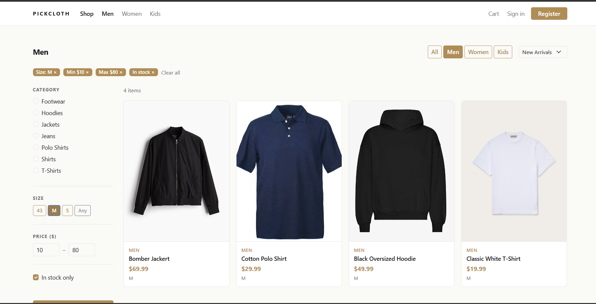
    
    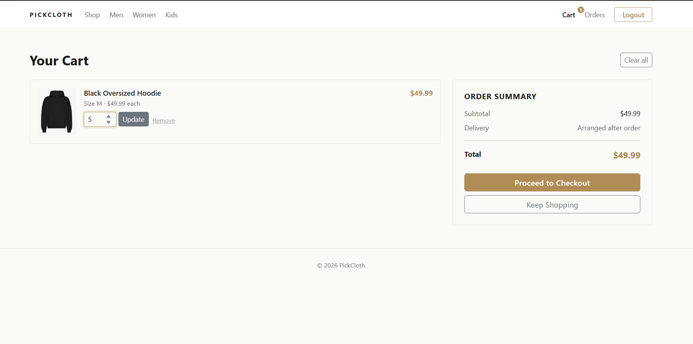
  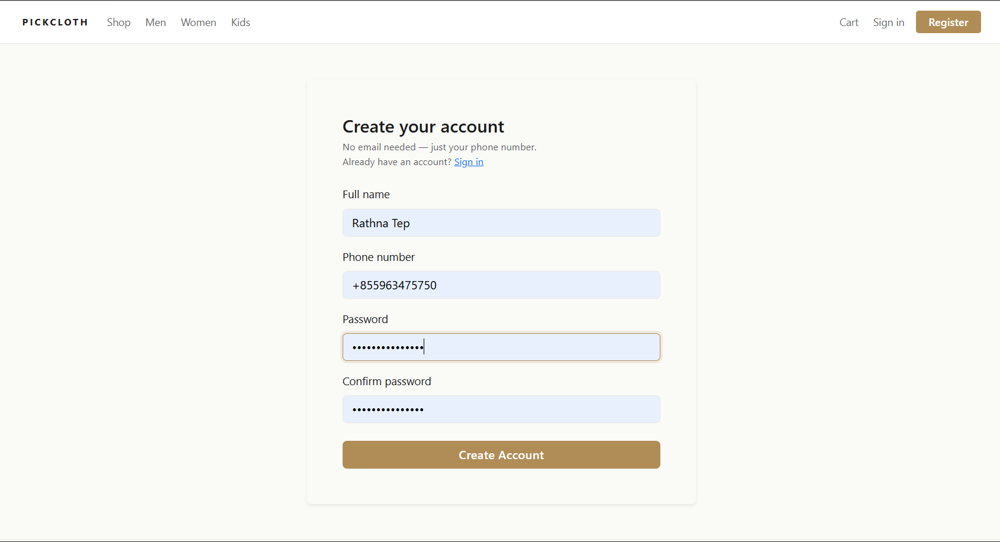
    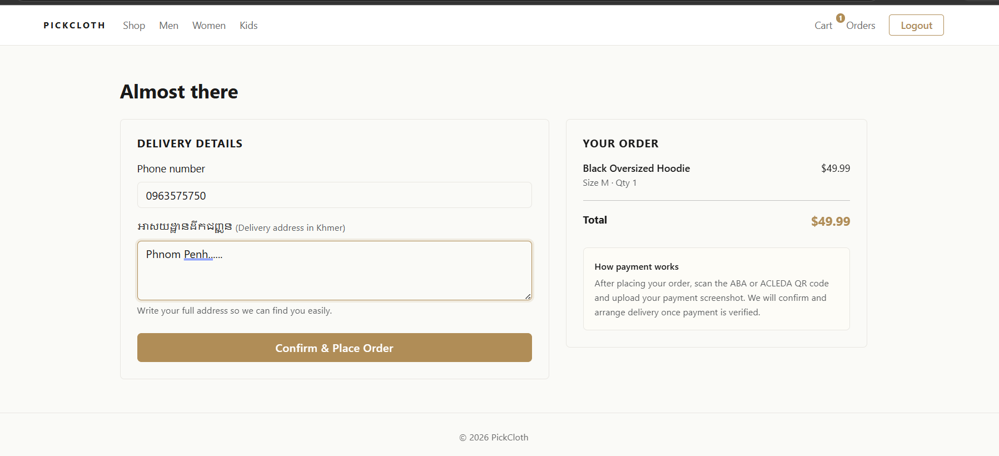
      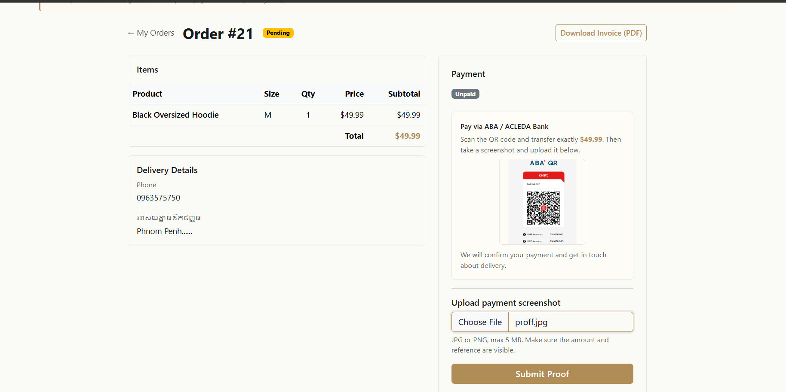
        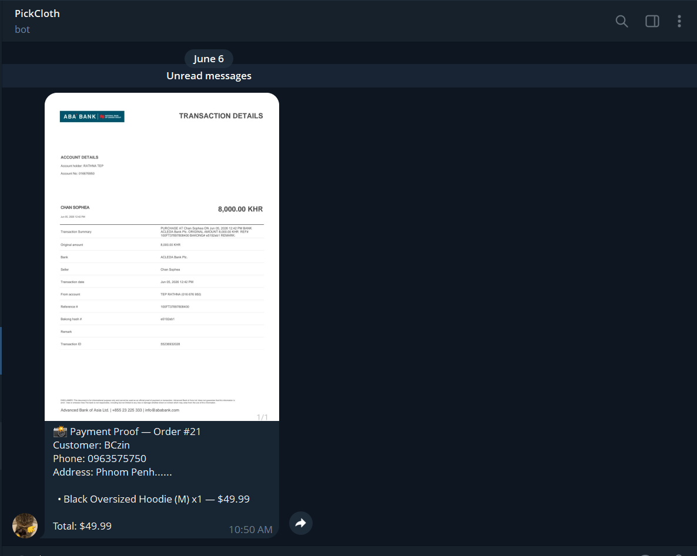
          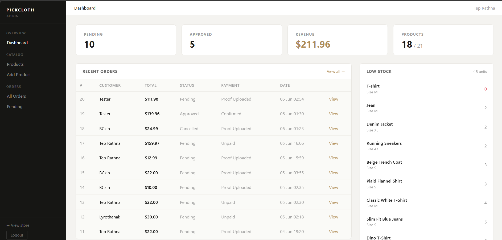
            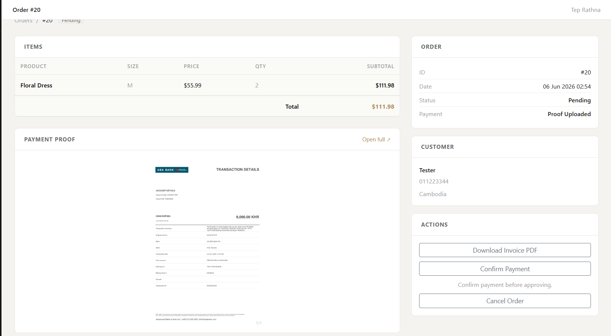
              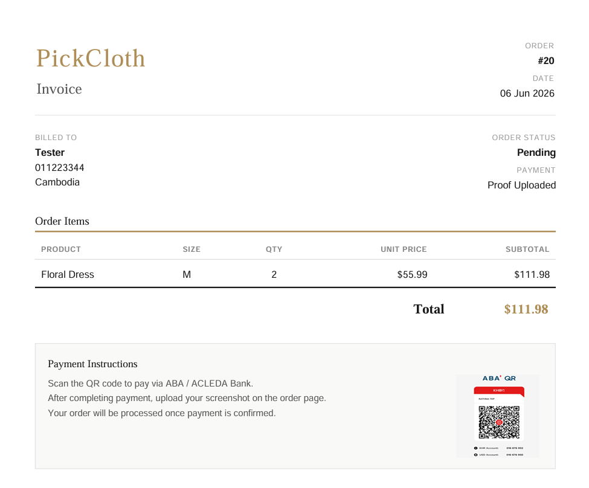
                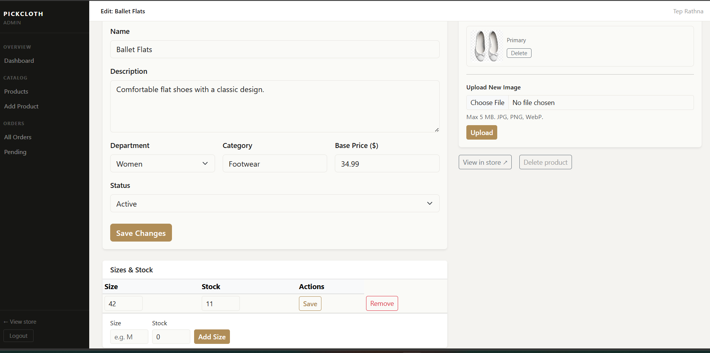
                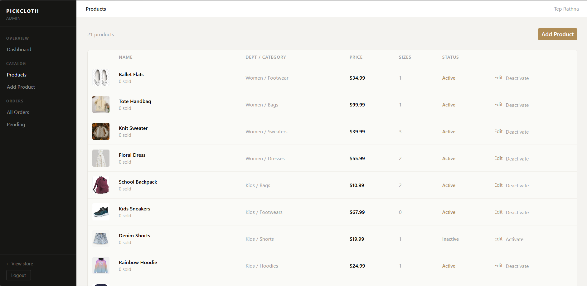

</p>

## License

The Laravel framework is open-sourced software licensed under the [MIT license](https://opensource.org/licenses/MIT).
